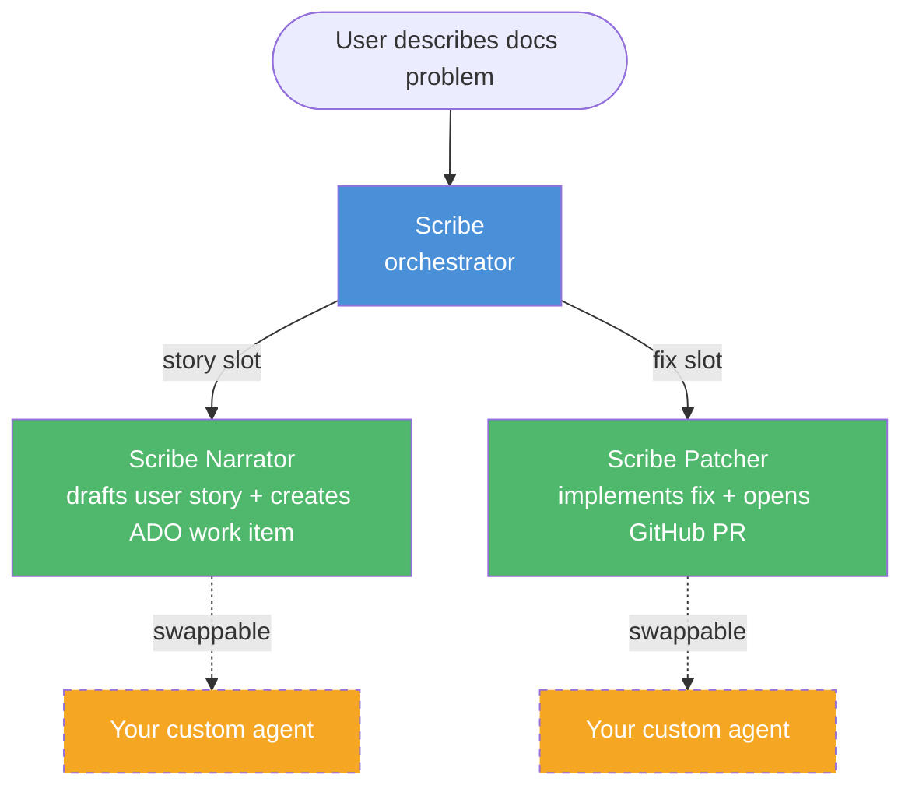

# Scribe

Documentation triage orchestrator with dependency injection for sub-agents. Describe a documentation problem and Scribe drafts a user story in Azure DevOps, implements the fix, and ships a PR on GitHub, **all in one shot**.

Each step is a swappable **capability slot** resolved from a config file at runtime, inspired by Entity Framework's IoC/DI model. Ship opinionated defaults, override anything, survive orchestrator updates.



## Install

Clone and point VS Code at this repo's agents:

```bash
git clone https://github.com/seesharprun/scribe.git
```

In the target workspace's VS Code settings (`settings.json`), add:

```json
{
  "chat.agentFilesLocations": [
    { "path": "<path-to-cloned-scribe>/.github/agents" }
  ]
}
```

**Scribe** will appear in the agent picker. The sub-agents are hidden.

## Use

Select **Scribe** from the agent picker and describe a docs problem:

```
The Node.js quickstart has a broken code sample on line 42 of getting-started.md
```

With zero config, Scribe uses the built-in **Scribe Narrator** (ADO) and **Scribe Patcher** (GitHub PR).

## Inject your own sub-agent

1. Create a `.agent.md` file in your repo at `.github/agents/` that returns the same output contract as the slot you're replacing (see the capability slots table above).

2. Create `.github/agents/scribe.agent.config.yml` in your repo:

    ```yaml
    version: 1

    services:
      story: My Custom Narrator    # your agent's name
      fix: Scribe Patcher          # keep the default
    ```

3. Invoke Scribe normally — it picks up the override automatically.
